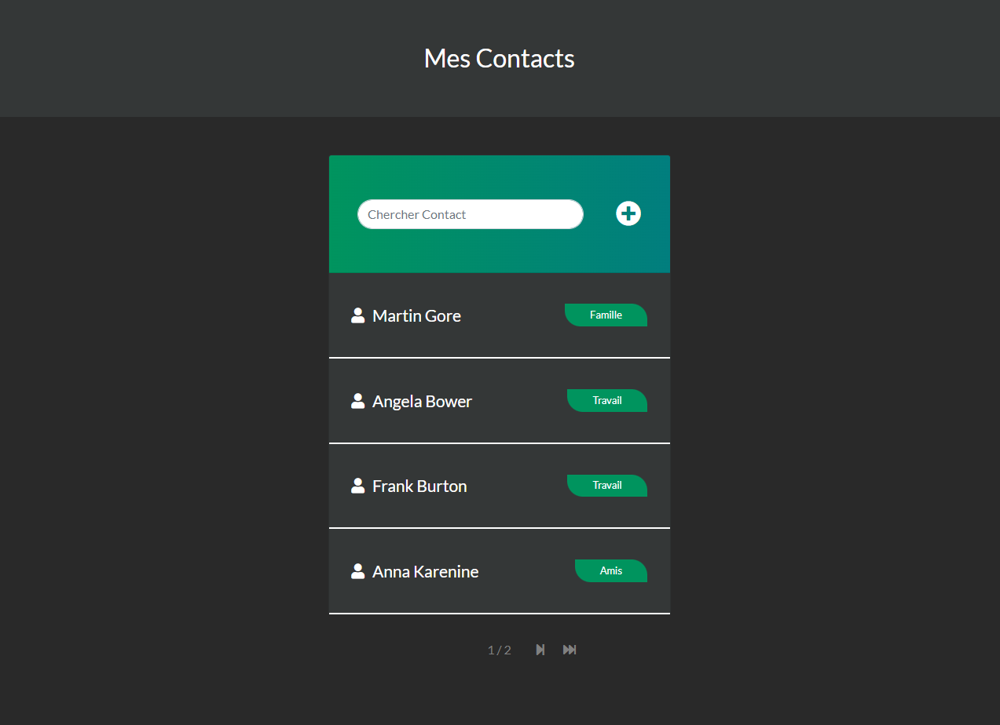
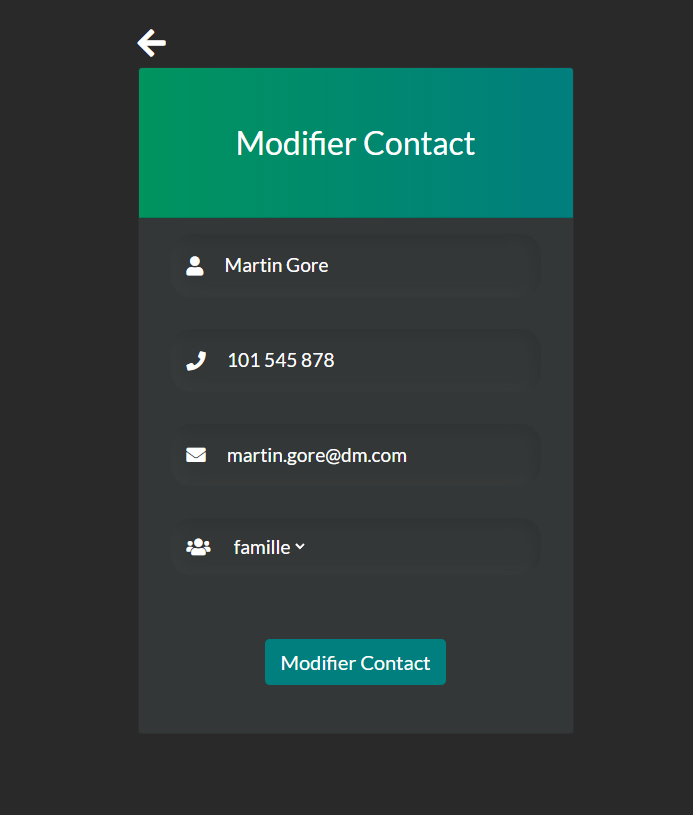

# CONTACTS
___

## Table of Contents
1. [General Info](#general-info)
2. [Technologies](#technologies)
3. [Installation](#installation)

___

### GENERAL INFO

Contacts is under construction - Its name too :))

Contacts is for the moment an application used to store contacts informations (name, email, phone, group) and to send an email
or sms.

Application allows to add, edit, delete a contact




___

### TECHNOLOGIES

* [Python](https://www.python.org/): Version 3.9.2
* [Django](https://www.djangoproject.com/): Version 4.0.1
* [Bootstrap](https://getbootstrap.com/): Version 5.1.3


___

### INSTALLATION

1. Clone the project

`$ git clone https://github.com/dardevetdidier/Contacts.git`

2. In project directory, create and activate virtual environment
```
$ python -m venv venv
$ source venv/Scripts/activate
```
3. Install dependencies

`$ pip install -r requirements.txt`

4. Environment Variables
   * Create a file `.env` in the root of the project
   * In `.env` add : SECRET_KEY=<Your_SecretKeyOfDjango!>


5. migrations and Create admin user

```
$ python manage.py migrate
$ python manage.py createsuperuser
```

6. Run server

`$ python manage.py runserver`


